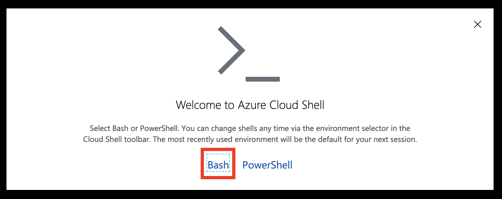
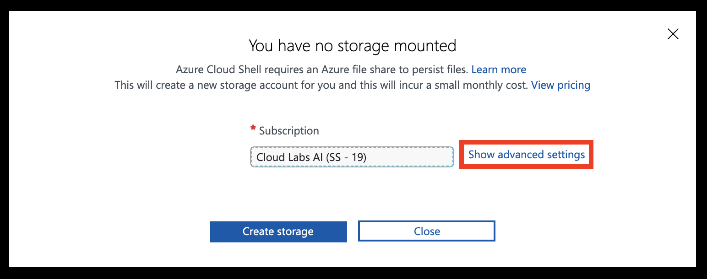
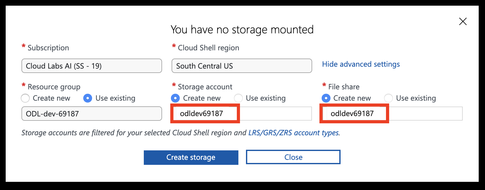
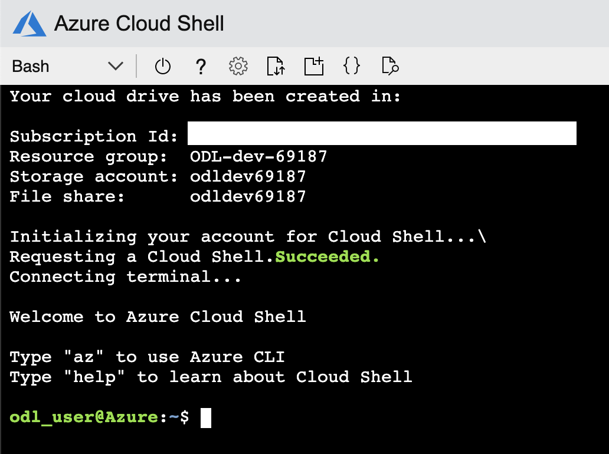
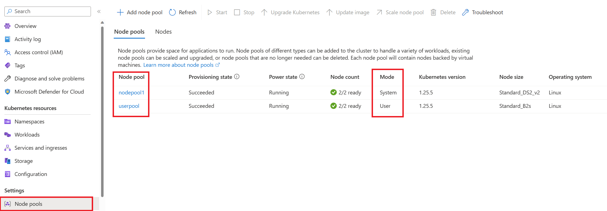

# The Azure Kubernetes Workshop - Lab n°1

Welcome to the Azure Kubernetes Workshop n°1. In this lab, you'll go through tasks that will help you master the basic and more advanced topics required to deploy a containerized application to Kubernetes on [Azure Kubernetes Service (AKS)](https://azure.microsoft.com/en-us/services/kubernetes-service/).

You can use this guide as a Kubernetes tutorial and as study material to help you get started learning Kubernetes.

Some things you'll be going through:

- Create Kubernetes cluster
- Deploying the app to AKS and accessing it publicly

---

## Prerequisites

### Tools

This course is entirely explained from a Linux environment (on Windows, a quick win can be to [go with the Windows Linux Subsystem](https://learn.microsoft.com/en-us/windows/wsl/install) or [Git BASH](https://gitforwindows.org)).

You can use [the Azure Cloud Shell service](https://shell.azure.com) once you log in with an Azure subscription. The Azure Cloud Shell has the Azure CLI pre-installed and configured to connect to your Azure subscription, as well as [kubectl](https://github.com/kubernetes/kubectl).

Alternatively, you need to meet the following requirements:

- [Azure CLI](https://github.com/Azure/azure-cli) v2.83.0 (or superior)
- [kubectl](https://github.com/kubernetes/kubectl) v0.32.0+
- [Kubernetes](https://kubernetes.io) v1.32+ (managed from [Azure Kubernetes Service](https://learn.microsoft.com/en-us/azure/aks))

### Azure subscription

#### If you have an Azure subscription

Open any terminal, either a local one (PowerShell, WSL, VSCode terminal or Cloud Shell) and log in to your personal subscription. In parallel, log in to the [the Azure Portal](https://portal.azure.com).

<div class="warning" data-title="Warning">

> Ensure that you are connected to the right subscription. The CLI may be connected to the wrong one! Use the az account show to be sure that you are targeting the right subscription!
</div>

<details>
<summary>Solution: Login to Azure CLI</summary>

Please consider using your username and password to login into [the Azure Portal](https://portal.azure.com). Also, please authenticate your Azure CLI by running the command below on your machine and following the instructions.

```sh
az account show
az login
```

If you need to select a specific subscription, use the command *az account set*

</details>

#### Azure Cloud Shell

Prefer the local command line but if you are stuck, you can use the Azure Cloud Shell accessible at <https://shell.azure.com> once you log in with an Azure subscription.

<details>
<summary>Solution: Setup Azure Cloud Shell</summary>

Head over to <https://shell.azure.com> and sign in with your Azure Subscription details.

Select **Bash** as your shell.



Select **Show advanced settings**



Set the **Storage account** and **File share** names to your resource group name (all lowercase, without any special characters), then hit **Create storage**



You should now have access to the Azure Cloud Shell



</details>

#### Tips for uploading and editing files in Azure Cloud Shell

- You can use `code <file you want to edit>` in Azure Cloud Shell to open the built-in text editor.
- You can upload files to the Azure Cloud Shell by dragging and dropping them
- You can also do a `curl -o filename.ext https://file-url/filename.ext` to download a file from the internet.

#### Registering some modules

As a test, with your command line and once logged on the right subscription, run the following command

```
az provider register --namespace Microsoft.Network
az provider register --namespace Microsoft.ContainerService
az provider register --namespace Microsoft.Compute
```

## Container and Kubernetes basics

In this lab, you will be creating and deploying containers.

To ensure a smooth experience, please familiarize yourself beforehand with container basics using [Docker introduction on MS Learn](https://learn.microsoft.com/en-us/dotnet/architecture/microservices/container-docker-introduction/). Alternatively, you can check [Docker's Get started guide](https://docs.docker.com/get-started/).

If you are keen to explore the advanced optional sections, we strongly encourage you to have some prior knowledge of Kubernetes and its concepts. If you are new to Kubernetes, start with the [Kubernetes Learning Path](https://learn.microsoft.com/en-us/training/paths/intro-to-kubernetes-on-azure/) to learn Kubernetes basics, then go through the concepts of [what Kubernetes is and what it isn't](https://aka.ms/k8sLearning).

If you are a more experienced Kubernetes developer or administrator, you may have a look at the [Kubernetes best practices](https://www.the-aks-checklist.com).


## Application Overview

You will be deploying a web application that is containerized, served from AKS, and publicly accessible.

Further optional sections will extend this application with additional features using a microservice architecture.


## Tasks

Useful resources are provided to help you work through each task. If you're working through this as part of a team-based exercise, ensure you make progress at a good pace by dividing the workload between team members when possible. This may require work that might be needed in a later task.

<div class="tip" data-title="Hint">

> If you get stuck, you can ask for help from the proctors. You may also choose to peek at the solutions, but the idea of this lab is for you to look a little bit by yourself.

</div>

### Core tasks

Running through this as part of a half-day workshop, you should be able to complete the **Getting up and running** section. This involves setting up a Kubernetes cluster, deploying the application container from Azure Container Registry, and checking that the application is fully working.

---

# Getting up and running


## Deploying Kubernetes with AKS (30m)

Azure has a managed Kubernetes service, AKS (Azure Kubernetes Service), you will use this to easily deploy a Kubernetes cluster.
Azure has also a managed registry service, ACR (Azure Container Registry), you will use ACR to push/pull your image.

#### Create Azure Container Registry

**Task Hints**

* It's recommended to use the Azure CLI and the `az acr create` command to deploy your ACR. Refer to the docs linked in the Resources section, or run `az acr create -h` for details. If you don't have a resource group yet, don't forget to create it first ;-)

Create ACR

<details>
<summary>Solution: Create ACR</summary>

```sh
az acr create \
  --name <unique-registry-name> \
  --resource-group <resource-group> \
  --location <region> \
  --sku Standard
```

</details>

This container registry will be attached later to your AKS cluster.

#### Get the latest Kubernetes version available in AKS

You can either let Azure choose the default version of kubernetes for you or you can specify the version during the creation of the cluster. To know which version of kubernetes is supported in your region, use the command `az aks get-versions`

<details>
<summary>Solution: Get latest Kubernetes version</summary>

Get the latest available Kubernetes version in your preferred region and store it in a bash variable. Replace `<region>` with the region of your choosing, for example `eastus`.

```sh
version=$(az aks get-versions -l <region> --query 'values[] | [0].version' -o tsv)
```

The command above returns the newest version of Kubernetes available to deploy using AKS. Newer Kubernetes releases are typically made available in "Preview". To get the latest non-preview (a.k.a the 'stable') version of Kubernetes, use the following command instead.

```sh
version=$(az aks get-versions -l <region> --query 'values[?!isPreview] | [0].version' -o tsv)
```

</details>

#### Create the AKS cluster

**Task Hints**

* It's recommended to use the Azure CLI and the `az aks create` command to deploy your cluster. Refer to the docs linked in the Resources section, or run `az aks create -h` for details
* The size and number of nodes in your cluster is not critical, but two nodes of type `standard_a2_v2` or `Standard_D2S_v2` or larger is recommended
* You should give the cluster access to the container registry by "attaching" it
* You can optionally create AKS clusters that support the [cluster autoscaler](https://docs.microsoft.com/en-us/azure/aks/cluster-autoscaler#about-the-cluster-autoscaler). We will focus more on this in the advanced sections
* The cluster must have a second nodepool with 2 VMs, with SKU 'Standard_B2s' (if you have an error with a quota filled, just don't create the second nodepool, that's OK)

<div class="warning" data-title="Warning">

> Please attach the ACR with a second command (az aks update --attach-acr). You could create it with the az aks command, but some proxies (zscaler) make the command fail.

</div>

Create AKS using the latest version

<details>
<summary>Solution: Create AKS cluster</summary>

```sh
az aks create \
  --resource-group <resource-group> \
  --name <unique-aks-cluster-name> \
  --location <region> \
  --kubernetes-version $version \
  --generate-ssh-keys \
  --node-count 2 \
  --network-plugin azure \
  --node-vm-size Standard_A2_v2 \
  --network-policy calico \

az aks nodepool add \
  --resource-group <resource-group> \
  --cluster-name <unique-aks-cluster-name> \
  --name userpool \
  --node-count 2 \
  --node-vm-size Standard_B2s
```

Attach the ACR

```bash
az aks update -n myAKSCluster -g myResourceGroup --attach-acr <acr-name>
```

The userpool is used to isolate the pods you will create from the default one managed by the Kubernetes system and you should see something like this:



> **Notes**
>
> You can optionally enable the autoscaler using the options `--enable-cluster-autoscaler`, `--min-count`, and `--max-count` in `az aks create`.
>
> You can attach an ACR registry to an existing AKS cluster using `az aks update -n <cluster-name> -g <resource-group> --attach-acr <registry-name>`

</details>

#### Ensure you can connect to the cluster using `kubectl`

**Task Hints**

* `kubectl` is the main command line tool you will use for working with Kubernetes and AKS. It is already installed in the Azure Cloud Shell
* Refer to the AKS docs, which includes [a guide for connecting kubectl to your cluster](https://docs.microsoft.com/en-us/azure/aks/kubernetes-walkthrough#connect-to-the-cluster) (Note: if you are using the Azure Cloud Shell you can skip the `install-cli` step because `kubectl` is already installed).
* A good sanity check is listing all the nodes in your cluster `kubectl get nodes`.
* [This is a good cheat sheet](https://kubernetes.io/docs/reference/kubectl/cheatsheet/) for kubectl.

<details>
<summary>Solution: Connect to the AKS cluster</summary>

Authenticate against the cluster. The `az aks get-credentials` connect to the cluster and create a local kubeconfig file which will be used by `kubectl` to connect to the cluster.

```sh
az aks get-credentials --resource-group <resource-group> --name <unique-aks-cluster-name>
```

List of the available nodes

```sh
kubectl get nodes
```

> **Notes**
>
> If `kubectl` has some issues to connect to your cluster, you can run the command:
> `export KUBECONFIG=PATH_TO_KUBERNETES_CONFIG_FILE` to specify the path to the credentials generated from the previous `az aks get-credentials` command

</details>

Try some other commands like. Try to find them from the [documentation](https://kubernetes.io/docs/home/) or in the [cheatsheet](https://kubernetes.io/docs/reference/kubectl/cheatsheet)

* List all namespaces
* List pods in namespace system
* List pods in all namespaces
* List all elements in namespace kube-system

<details>
<summary>Solution: Common kubectl commands</summary>

```sh
kubectl get namespaces
kubectl get ns

kubectl get pods -n kube-system

kubectl get pods --all-namespaces
kubectl get pods -A

kubectl get all -n kube-system
```

</details>

> **Resources**
>
> * <https://docs.microsoft.com/en-us/azure/aks/kubernetes-walkthrough>
> * <https://learn.microsoft.com/en-us/azure/aks/cluster-container-registry-integration?tabs=azure-cli>
> * <https://docs.microsoft.com/en-us/cli/azure/aks?view=azure-cli-latest#az-aks-create>
> * <https://docs.microsoft.com/en-us/azure/aks/kubernetes-walkthrough-portal>
> * <https://docs.microsoft.com/en-us/azure/aks/kubernetes-walkthrough#connect-to-the-cluster>
> * <https://kubernetes.io/docs/reference/kubectl/cheatsheet/>
> * <https://learn.microsoft.com/en-us/azure/container-registry/container-registry-intro>
> * <https://learn.microsoft.com/en-us/cli/azure/acr?view=azure-cli-latest#az-acr-create()>


## Deploying the app to AKS (20m)

In this section, you will import an image (web app) from a public repository in your Azure Container registry and then deploy this web app in your AKS cluster.

#### Import an image in ACR

**Task Hints**

* It's recommended to use the Azure CLI and the `az acr import` command to import the image in your ACR. Refer to [ACR import image](https://learn.microsoft.com/en-us/cli/azure/acr?view=azure-cli-latest#az-acr-import()), or run `az acr import -h` for details
* The image that will be imported is a hello world web app **[docker.io/lgmorand/catnip](docker.io/lgmorand/catnip)**, please use tag v1
* Rename the image to aks-helloworld, tag v1

<div class="warning" data-title="Warning">

> If you get an error during the command or can't see container images in the portal, it means that you don't have enough rights. You need to add yourself as contributor to the ACR.

</div>

<details>
<summary>Solution: Import image to ACR</summary>

```sh
az acr import \
  --name <registry_name> \
  --source docker.io/lgmorand/catnip:v1 \
  --image aks-helloworld:v1
```

</details>

Check that your image was successfully imported. You can do it graphically (Web Portal) or using [the CLI](https://learn.microsoft.com/en-us/cli/azure/acr/repository?view=azure-cli-latest)

<details>
<summary>Solution: Verify imported image</summary>

```sh
az acr repository list --name <registry_name>
```

You should see an output similar to:

```sh
[
  "aks-helloworld"
]
```

```sh
az acr repository show-tags -n <registry_name> --repository aks-helloworld
```

You should see an output similar to:

```sh
[
  "v1"
]
```

</details>

#### Create a deployment manifest

The application is now in your own container registry so you don't rely on the availability of hub.docker.com. Now, you need a deployment manifest file to deploy your application. The manifest file allows you to define what type of resource you want to deploy and all the details associated with the workload.

Kubernetes groups containers into logical structures called pods, which have no intelligence. Deployments add the missing intelligence to create your application.

Create a deployment file to deploy your application. The application expect to run on port 5000 and using 'http'.

<details>
<summary>Solution: Deployment manifest</summary>

Create a `deployment.yaml` file with the following contents, and make sure to replace `<registry-fqdn>` with the fully qualified name of YOUR registry (FQDN = full server URL):

```yaml
# deployment.yaml
apiVersion: apps/v1
kind: Deployment
metadata:
  name: aks-helloworld
spec:
  selector: # Define the wrapping strategy
    matchLabels: # Match all pods with the defined labels
      app: aks-helloworld # Labels follow the `name: value` template
  template: # This is the template of the pod inside the deployment
    metadata:
      labels:
        app: aks-helloworld
    spec:
      nodeSelector:
        kubernetes.io/os: linux
      containers:
        - image: <YOUR-registry-fqdn>/aks-helloworld:v1 # Replace registry-fqdn with the fully qualified name of your registry
          name: aks-helloworld
          ports:
            - name: http
              containerPort: 5000   
```

</details>

#### Deploy the web app image using the manifest

Use `kubectl` to apply the manifest and deploy the app.

<details>
<summary>Solution: Apply the deployment</summary>

Apply the deployment:

```sh
kubectl apply -f ./deployment.yaml
```

Then ensure it was successful:

```sh
kubectl get deploy aks-helloworld
```

You should see an output similar to:

```sh
NAME             READY   UP-TO-DATE   AVAILABLE   AGE
aks-helloworld   1/1     1            1           32s
```

</details>

Use `kubectl get pods` to check if the pod is running. Obtain the name of the created pod.

<details>
<summary>Solution: Check running pods</summary>

```sh
kubectl get pods
```

You should see an output similar to:

```sh
NAME                               READY   STATUS    RESTARTS   AGE
aks-helloworld-7bb8fc8c5-vksfc     1/1     Running   0          55s
```

</details>

> **Resources**
>
> * <https://kubernetes.io/docs/concepts/workloads/controllers/deployment/>
> * <https://kubernetes.io/docs/concepts/services-networking/service/>
> * <https://learn.microsoft.com/en-us/training/modules/aks-deploy-container-app/5-exercise-deploy-app/>


## Enabling public access (30m)

Now that you have deployed the application to AKS, it is time to expose it to the internet to allow clients to use it.
By default, Kubernetes blocks all external traffic, so you will need to add a service with a public IP to allow traffic into the cluster.

In this section, you will expose the application by creating a [Service](https://kubernetes.io/docs/concepts/services-networking/service/).

#### Test the app

Make a request to the newly deployed web app and ensure it displays something in your browser using port 80. Warning: the exposed port is not the same as the one expected by the application.

**Task Hints**

* Create a service with a public IP to expose your web app
* Expose the Service externally using an external load balancer. Try to find the right service type to use in the [documentation](https://kubernetes.io/docs/concepts/services-networking/service/#publishing-services-service-types)

<details>
<summary>Solution: Create and deploy the LoadBalancer service</summary>

Create a `service.yaml` file with the following contents:

```yaml
apiVersion: v1
kind: Service
metadata:
  name: aks-helloworld-svc
spec:
  type: LoadBalancer
  selector:
    app: aks-helloworld
  ports:
    - port: 80 # SERVICE exposed port
      name: http # SERVICE port name
      protocol: TCP # The protocol the SERVICE will listen to
      targetPort: 5000 # Port to forward to in the POD    
```

Deploy the service:

```sh
kubectl apply -f ./service.yaml
```

Then ensure it was successful:

```sh
kubectl get svc
```

You should see an output similar to:

```sh
NAME                 TYPE           CLUSTER-IP     EXTERNAL-IP    PORT(S)        AGE
aks-helloworld-svc   LoadBalancer   10.0.203.158   4.207.207.53   80:31493/TCP   13s
```

You can now load the URL `http://<EXTERNAL-IP>` on your browser and ensure it returns `Hello, this is my first AKS deployment`.

</details>

> **Resources**
>
> * <https://kubernetes.io/docs/concepts/services-networking/>


## Network Policy (10m)

Now that your application is exposed, you are going to test how network policies work.

#### Block all traffic

A general good practice with network security is to block all traffic by default (in both ways) and then whitelist the allowed traffic.
Create a [NetworkPolicy](https://kubernetes.io/docs/concepts/services-networking/network-policies/) applied to all pods in your namespace. Block ALL traffic in ingress and egress. 

Once deployed, check if you can still access your application.

<details>
<summary>Solution: Deny-all NetworkPolicy</summary>

```yaml
apiVersion: networking.k8s.io/v1
kind: NetworkPolicy
metadata:
  name: default-deny
  namespace: default
spec:
  podSelector: {}
  policyTypes:
  - Ingress
  - Egress
```

</details>

<div class="warning" data-title="Warning">

> It is possible that it does **not** work. It's because when you created the cluster, you didn't enable the network plugin and thus, all network policies are ignored by default. Thus, you must **recreate** the cluster from scratch, and use the parameter --network-policy and use a plugin such as calico

</div>

#### Enable again the traffic from Internet

Now, without removing the DenyAll policy, add a second policy, specifically applied to your pod to allow traffic coming from Internet.
Once again, deploy it and check that you can now access your application.

<details>
<summary>Solution: Allow ingress from Internet</summary>

```yaml
kind: NetworkPolicy
apiVersion: networking.k8s.io/v1
metadata:
  name: web-all-from-internet
spec:
  podSelector: 
    matchLabels:
      app: aks-helloworld
  ingress: 
  - {}
```

</details>

Easy, isn't it?

---

# Play around


## Let's dig (30m)

The lab is finished but nothing prevents you from digging a little bit and playing with your cluster. You won't get any help; a search engine or Kubernetes documentation can help you.

Here are some new missions for you:

- From the Web Portal, try to get some info about the running pods
- Try to find your VMs in Azure. Are they in your resource group?
- Try to retrieve the YAML which has been used to deploy your pod
- Try to get some metrics such as CPU/memory usage
- In which namespace is your application deployed? Move it to a namespace which is your first name
- Ensure you delete your pod from the default namespace
- More complex: deploy an nginx controller and an ingress route to expose your app

---

# Clean up

Once you're done with the workshop, make sure to delete the resources you created. You can read through [manage Azure resources by using the Azure portal](https://docs.microsoft.com/en-us/azure/azure-resource-manager/manage-resources-portal) or [manage Azure resources by using Azure CLI](https://docs.microsoft.com/en-us/azure/azure-resource-manager/manage-resources-cli) for more details.

